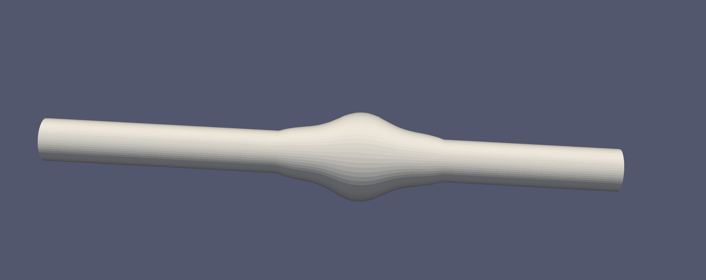
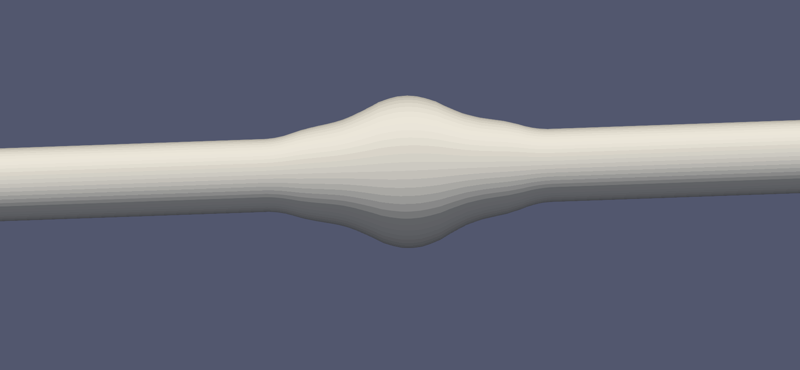
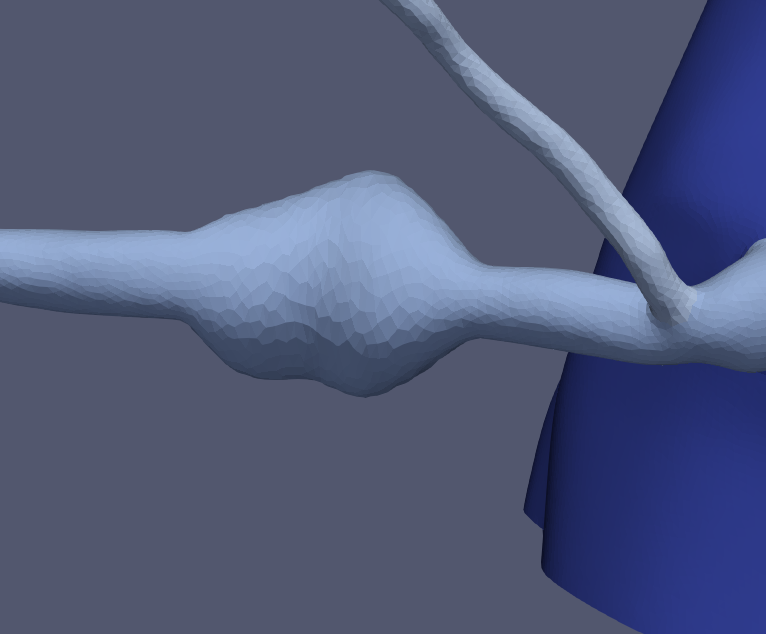
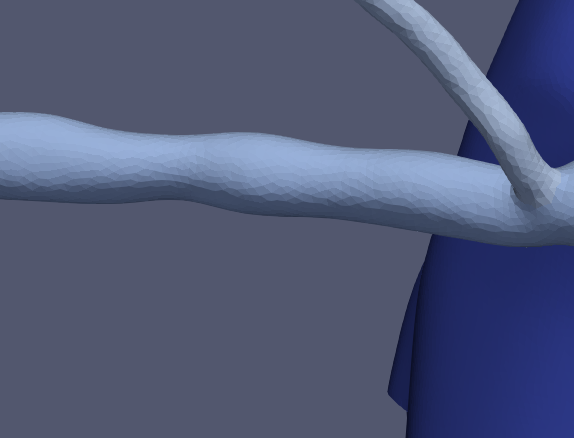

## AneurysmGeneration

We want to artificially generate realistic aneurysms. 

## Current progress: 

A script has been written to expand the shell points to produce an aneurysm-like shape which is radially symmetric about the cross section. 

Further steps will be taken to generate different kinds of shapes. 

Progress was also made to increase the smoothness of the aneurysm surface. Initially, the number of centerline points was insufficient, and many points along the vessel surface were mapping to the same centerline coordinate. Increasing the number of centerline points allows for a smoother-looking surface post-expansion. 

Implementation of clamped boundary conditions allows for a smoother transition zone (zero first derivative) into healthy coronary vessel. 

As of 2/1/2018: Full model generation kind of works! Shapes are awkward but full model is workable. 

### Notes:
* discovered that the model looked ribbed because there were not enough points in the centerline; centerline points increased.
* ridge when bc is not 0 looks really awkward; now using 1D cubic spline interpolation allowing zero-derivative boundary conditions.  

### Next steps: 
* 