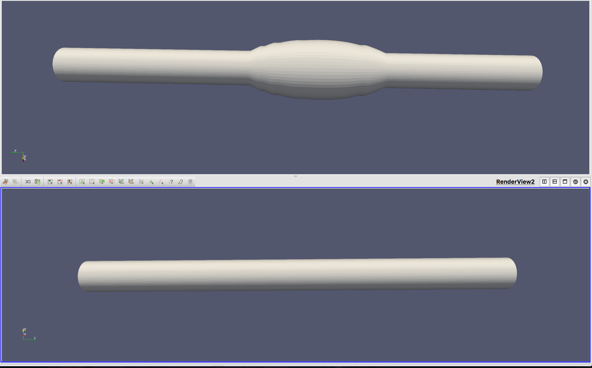

## AneurysmGeneration

We want to artificially generate realistic aneurysms. 

## Current progress: 

A script has been written to expand the shell points to produce an aneurysm-like shape which is radially symmetric about the cross section. 

Further steps will be taken to generate different kinds of shapes. 

### Notes:
* discovered that the model looked ribbed because there were not enough points in the centerline; centerline points increased. 

### Next steps: 
* work on a real model 