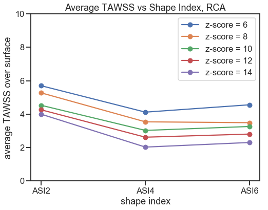

## Artificial Coronary Arterial Aneurysms
### Systematic Evaluations of Aneurysmal Hemodynamics 

The goal is to artificially generate coronary arterial aneurysms from a health baseline coronary tree, according to a wide range of sizes and shapes. Computational hemodynamics and post processing are used to explore relationships between aneurysmal size, shape, and hemodynamics. 

## Current progress: 

The full pathway is 
1. generate aneurysms 
2. mesh the aneurysm model 
3. run simulation on Sherlock
4. post process results
5. map mesh and model points 
6. use mapping to extract relevant region and clip out the aneurysm for analysis 
7. use paraview scripting to integrate variables over the surface of the aneurysm. 
8. visualizations

`AneurysmGeneration` corresponds to step 1 , `batch_clip.sh`, `prelim_analysis.py`, `another_clipper.py` correspond to step 5-6. `integrator_script.py` is used for step 7. There are several notebooks which contain visualization and analysis code. 

The desired analysis is: 
* Time-averaged Wall Shear Stress (TAWSS) as a function of Z-score/position
* Range of TAWSS as a function of Z-score/position
* CDF of TAWSS/area. 

## Methods 
### Dependencies: 
* `vtk`
* `numpy`
* `scipy`
* `matplotlib`
* `argparse`
* `paraview`

### Generation 
A script has been written to manipulate the points of the model vtp file to produce an aneurysm-like shape which is radially symmetric about the cross section. It is possible to specify the aneurysm shape and length to fit different shape indices. It is possible to control the position along the vessel. 

The current method involves interpolation of radius as a function of path length, and does not consider path curvature or the underlying radial distribution in the Frenet-Serre frame; the result is potentially off-center aneurysms with non-smooth expansion and contraction at the inflow and outflow. Code has also been developed for 2-D interpolation that maps (s, theta) -> r, but the interpolating function is not well behaved. The current workaround is boolean expansion as max(original radius, new radius) coupled with smoothing in Simvascular after aneurysm generation. 

### Post Processing
Read in the parameters that were used to generate the actual aneurysm, then map the points from the mesh to the model to extract the right branch. From the right branch, we can isolate the points corresponding to the aneurysm. From this, we can define two `vtkPlane`s and cut the aneurysm. The true aneurysmal region, and not any other part of the model, will be identified using a `vtkConnectivityFilter`. 

Once the aneurysmal region is isolated, we can extract relevant quantities over the surface. In particular, current analysis has focused on distributions of time-averaged wall shear stress over the surface. 

## Analysis 

Analysis of artificial aneurysms introduced in the RCA and LAD for `z_scores = [6, 8, 10, 12, 14]`, with following params: 
* RCA: ASI = 2, positions = proximal, medial, distal
* RCA: ASI = 4, positions = proximal
* RCA: ASI = 6, positions = proximal
* LAD: ASI = 2, positions = proximal 
* LAD: ASI = 4, positions = proximal
* LAD: ASI = 6, positions = proximal 

An example of isolated aneurysms: RCA, ASI6, all z-scores: 

### Understanding distribution of TAWSS wrt aneurysm z-score, shape index

It is difficult to represent nuanced changes in three-dimensional flow patterns within the aneurysmal region with a single parameter. Towards this end, however, several visualizations dependent on time-averaged wall shear stress have been prepared. To better understand the relationship between aneurysm size, shape, we can see the following plots. 

#### Average TAWSS with respect to aneurysm shape
Here, we can see the average TAWSS as computed by numerical integration over the surface followed by division by aneurysmal surface area, stratified by aneurysm z-score. 

In the RCA: 

In the LAD: 

Under current AHA guidelines using z-score to stratify patient risk, we should be able to identify a value of average TAWSS `k` to separate high from low z-score cases. However, these plots indicate that a perfect separation cannot be achieved, suggesting that aneurysm hemodynamics cannot be predicted through size measurements alone. 

#### TAWSS area distribution with respect to aneurysm shape
Here, for each aneurysm, we can see the area fraction remaining after thresholding against a certain value of TAWSS, again stratified by aneurysm z-score. Again, horizontal decision boundary perfectly separating high from low z-scores cannot be achieved, again underscoring the need for better measures in predicting aneurysm hemodynamics. 

In the RCA: 

In the LAD: 

## Todo: 
* 

